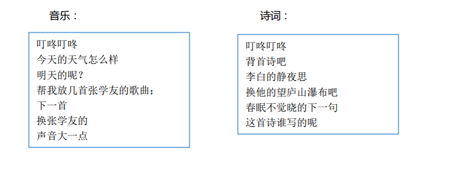

2.3 交互使用
=============

通过默认唤醒词 *叮咚叮咚* 即可唤醒。

2.3.1 示例交互
----------------

通过\ ``今天天气怎么样``\ 、\ ``给我唱首歌``\ 等命令或问法交互，AIUI即会返回结果并进行播报，
并且在手机端APP会有AIUI返回结果的显示。

以下为一些交互问法的示例：

2.3.2 LED灯提示
----------------

评估板麦克风上LED灯指示唤醒角度，底板上灯指示AIUI状态，状态定义如下：

+-------------------+--------------------+
|AIUI 状态          |LED 状态            |
+-------------------+--------------------+
|休眠状态           |灯灭                |
+-------------------+--------------------+
|未连接             |WiFi 红灯闪烁       |
+-------------------+--------------------+
|APPID校验不通过    | 红灯常亮           |
+-------------------+--------------------+
|录音状态           |绿灯常量            |
+-------------------+--------------------+
|拒识状态           |蓝灯亮              |
+-------------------+--------------------+

2.3.3 常见问题
---------------

Q：开发板可以外接屏幕吗
	A：不能。

Q：唤醒无声音播报
	A：参考 :ref:`AIUI配置 <aiui_client_config>` 中配置时确保勾选了\ **勾选启动后处理程序**\ 。
	
Q：交互一段时间后，去休息了，需要再次唤醒
	A：当 AIUI 发现超过 1 分钟（可设置）没有有效交互结果时，即会自动进入休眠状态。
	关于AIUI交互的休眠机制参见\ :ref:`休眠 <wakeup_sleep-label>`\ 。

Q：问法无回复播报
	A：AIUI根据已勾选的语义技能进行处理返回，本地客户端根据结果进行解析播报。
	如果有问法没有回复播报，按如下方法检查:
		
		1. 查看手机端的语义结果返回，根据 :ref:`语义结果 <nlp_result-label>` 中字 ``rc`` 字段判断
		
			rc字段为0
				有语义结果，没有播报是本地解析播报的问题，\ :ref:`联系我们反馈 <contact_us-label>`\ 。
				
			rc字段为4
				没有语义结果，检查服务端有没有对相应的语义进行勾选。
				如果已勾选，那是语义未覆盖该说法的原因，\ :ref:`联系我们反馈 <contact_us-label>`\ 。
	
.. _result_timeout-label:
	
Q：网络有点问题，我去休息了错误
	A：该播报由超时错误10120引起，识别语音上传后语义或者听写结果没有在特定时间（ :ref:`配置文件result_timeout定义 <aiui_cfg_label>` ）返回，则会出现10120错误。

		出现10120错误的原因有可能是网络状态差或者服务器处理缓慢的原因，可以按照如下方式验证排查：

		* 通过在AIUI模块上\ ``ping aiui.openspeech.cn``\ 检查本地到服务端的链接情况

		* 将开启日志的\ :download:`msc.cfg <msc.cfg>`\ 放入\ ``/sdcard/msc/``\ 下，交互复现超时的问题，
		  然后将\ ``/sdcard/msc/``\ 下的日志文件pull出来，发送给技术支持分析。
		  
.. _contact_us-label:
		  
Q：如何联系我们反馈
	A：通过论坛\ `AIUI解决方案 <http://bbs.xfyun.cn/forum.php?mod=forumdisplay&fid=80>`_\ 或通过
	\ `邮件 <msp_support@iflytek.com>`_\ 联系我们。
