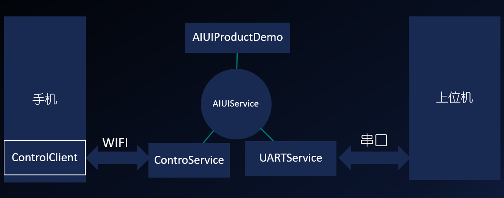

.. _dev_kit-label:

2.5 开发包
============

AIUI开发包为开发者提供了升级和集成AIUI需要的apk，依赖库及集成参考文档。

开发包下载需要登录到\ `AIUI应用管理 <http://www.xfyun.cn/aiui/manage>`_\ 下载。

开发包中包含了最新版本的AIUI软件，通过点击bin下面自动卸载安装的脚本，重新配置AIUI，即可升级AIUI软件。

开发包中包含的应用的功能和相互关系如下:

.. _demoboard_relationship-label:

2.5.1 Demo说明
--------------

sample下包含AIUIDemo和AIUIProductDemo，都是运行在AIUI评估板上。

AIUIDemo
	用于说明AIUI配置文件和接口的基本调用方法，该Demo需要界面操作，可以使用TotalControl或vysor进行操作
	
AIUProductDemo
	AIUI评估板默认播报程序程序的源码工程，包含完整的交互处理，如评估板的灯光控制，歌曲播报处理等

2.5.2 固件升级
--------------

除了AIUI软件的升级外，如果新增的功能需要涉及底层的修改，也同时需要升级固件。

固件的下载和更新参见\ `讯飞开放平台论坛 AIUI板块 <http://bbs.xfyun.cn/forum.php?mod=viewthread&tid=19132&highlight=AIUI%2B%E5%9B%BA%E4%BB%B6>`_\ 。

