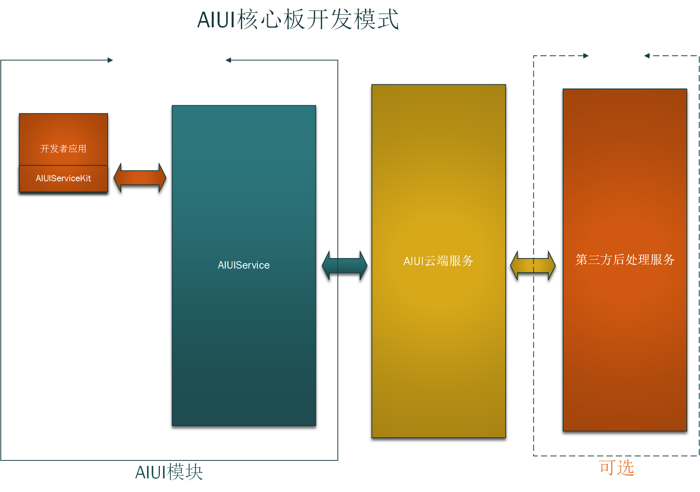

.. _coreboad-label:

3.1 核心板模式
---------------

3.1.1 结构说明
^^^^^^^^^^^^^^^

适用：因为AIUI硬件上的预留限制，核心板模式适用无屏幕连接要求，无特殊硬件要求（蓝牙或者红外AIUI模块均不支持）

整体结构如下：

开发者APP集成\ :ref:`AIUIServiceKit <AIUIServiceKitSDK-label>`\ ，运行在AIUI模块上，从AIUI Service获取结果，进行解析处理，与评估板上\ :ref:`AIUIProductDemo <demoboard_relationship-label>`\ 的效果类似。

3.1.2 SDK集成使用
^^^^^^^^^^^^^^^^^^^

参见\ :ref:`AIUIServiceKit SDK <AIUIServiceKitSDK-label>`\ 。

3.1.3 开发者程序自启动
^^^^^^^^^^^^^^^^^^^^^^

Android 4.4之后的版本，默认新安装未启动的程序处于Stopped状态，无法接受系统广播\ `BOOT_COMPLETE`\ 实现自启动，
所以AIUI添加对第三方应用自启动的支持。

第三方应用只需要创建Receiver，按照如下的配置接收AIUI的广播即可::

	<receiver android:name=".BootReceiver">
		<intent-filter>
			<action android:name="com.iflytek.aiuilauncher.action.BOOT_START"/>
		</intent-filter>
	</receiver>

