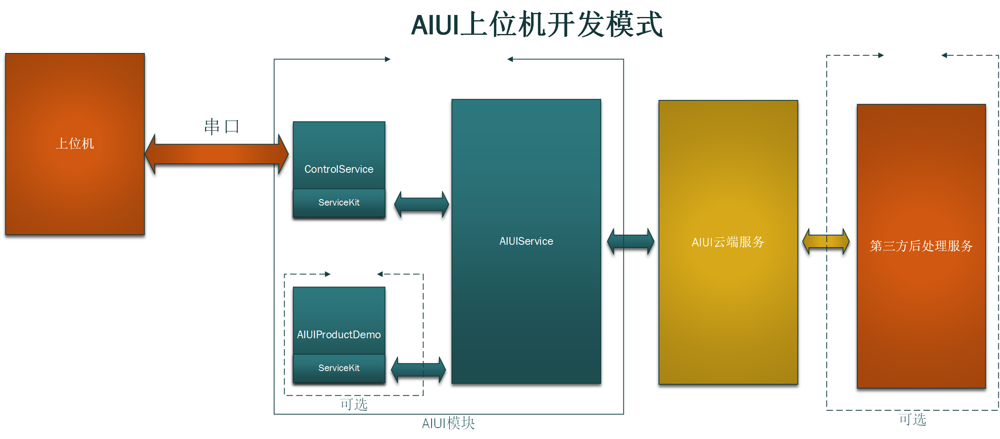

.. _ctrboard-label:

3.3 上位机模式
--------------

适用：上位机和AIUI模块通过串口通信，适用于有屏幕需求或硬件扩展需求（如机器人，智能家居等）

3.3.1 结构
^^^^^^^^^^^

UARTService充当AIUIService和上位机之间的中介，一面负责将AIUI的结果通过串口发送给上位机，一面将上位机通过串口发送的指令发送到AIUI。

AIUIProductDemo是个可选的选项，因为如果在上位机上对结果进行解析播放，那么AIUI模块上的AIUIProductDemo的播报就不必要了。

3.3.2 SDK 集成使用
^^^^^^^^^^^^^^^^^^^^^^^^

参见\ :ref:`串口SDK <uartkitSDK-label>`\ 。

