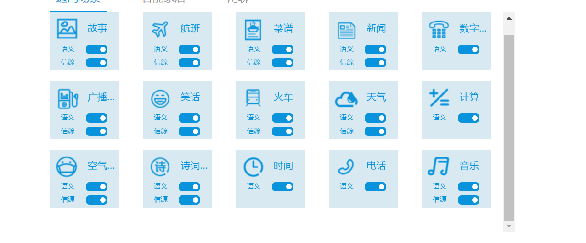

.. _nlp_result-label:

7.2 语义结果
-------------

语义结果是AIUI将听写结果解析成语义操作的结果。

7.2.1 示例
^^^^^^^^^^^

举例如下::

		{
			"intent": {
				"sid": "cid6f1c9ded@ch00d30b7dd6b201000b",
				"text": "开灯",
				"score": 1,
				"answer": {
					"text": "已为您打开灯"
				},
				"semantic": {
					"slots": {
						"attrType": "String",
						"attrValue": "开",
						"attr": "开关"
					}
				},
				"cid": "cid6f1c9ded@ch00d30b7dd229000000",
				"rc": 0,
				"operation": "SET",
				"dialog_stat": "dataInvalid",
				"service": "light_smartHome",
				"uuid": "atn000bda30@un46140b7dd6b50b2b01",
				"array_index": 0
			}
		}
	
7.2.2 字段定义
^^^^^^^^^^^^^^

字段中较为中较为重要的是\ ``service``\ 字段、\ ``semantic``\ 字段和\ ``answer``\ 字段，\ ``service``\ 指明操作的类型，\ ``semantic``\ 定义操作的具体语义，\ ``answer``\ 字段是建议播放的文本。

字段的详细定义解释参考\ :download:`雅典娜开放API文档 <Athena开放API规范文档（20161025）_V1.0.1.pdf>`

.. _ds_nlp-label:

7.2.3 语义和信源
^^^^^^^^^^^^^^^^

在AIUI后台管理界面的语义参数配置中，会看到有的场景(如音乐，新闻，故事等）有语义和信源两个选项可以勾选。

语义很容易理解是这句话表达的操作。

信源则是包含了动作的结果，比如音乐场景只勾选语义的话，说我想听刘德华的歌， 会返回如下结果::

	{
		"answer": {
			"text": "请欣赏刘德华的歌曲如果有一天"
		},
		"operation": "PLAY",
		"rc": 0,
		"semantic": {
			"slots": {
				"artist": "刘德华",
				"operation": "PLAY"
			}
		},
		"service": "musicX",
		"text": "我想听刘德华的歌",
		"uuid": "atn000c3ba8@un7ebd0b7dd8a10b2a01"
	}
	
如果同时勾选了信源，那结果除了包含上面的想听歌语义结果外还会包含歌曲的信息和播放地址::

	{
		"answer": {
			"text": "请欣赏刘德华的歌曲如果有一天"
		},
		"data": {
			"inherit": 0,
			"isCached": 0,
			"priority": 0,
			"result": [{
				"albumname": "刘德华 Unforgettable Concert 2010",
				"audiopath": "http://vbox.hf.openstorage.cn/ctimusic/128/2016-01-16/%E5%88%98%E5%BE%B7%E5%8D%8E/%E5%88%98%E5%BE%B7%E5%8D%8E%20Unforgettable%20Concert%202010/%E5%A6%82%E6%9E%9C%E6%9C%89%E4%B8%80%E5%A4%A91452920762.mp3",
				"itemid": "45621050",
				"movienames": [],
				"neatsongname": ["如果有一天"],
				"programname": "",
				"publishtime": 1303228800,
				"singeraliasnames": ["Andy Lau",
				"AndyLau",
				"Lau Tak Wah",
				"刘主席",
				"华Dee",
				"华仔",
				"华哥",
				"华神"],
				"singerids": ["25000"],
				"singernames": ["刘德华"],
				"songname": "如果有一天",
				"tagnames": ["酒吧",
				"民谣",
				"粤语",
				"兴奋",
				"KTV",
				"影视原声",
				"80后",
				"流行",
				"怀旧",
				""]
			}],
		},
		
		"operation": "PLAY",
		"rc": 0,
		"semantic": {
			"slots": {
				"artist": "刘德华",
				"operation": "PLAY"
			}
		},
		"service": "musicX",
		"text": "我想听刘德华的歌",
		"uuid": "atn000c3ba8@un7ebd0b7dd8a10b2a01"
	}

其他场景如故事，天气也类似。

**AIUI返回的信源内容（天气、音乐、故事、新闻等）默认只授权在评估板上使用，如需在自己的产品中使用，
请与我们的商务人员洽谈授权事宜（联系方式：msp_support@iflytek.com）。**

	
	
