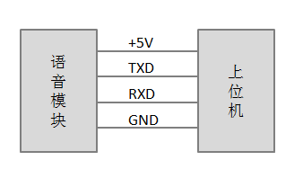

.. _uart_protocal-label:

9.1 AIUI串口协议
-----------------

9.1.1 概述
^^^^^^^^^^

上位机和AIUI语音模块之间通过串口进行数据交互。
上位机可以通过串口向AIUI语音模块发送握手消息同步状态，发送WIFI配置信息，发送AIUI配置消息，发送控制消息控制AIUI状态。

9.1.2 通信接口及参数
^^^^^^^^^^^^^^^^^^^^

* 波特率：115200
* 数据位：8
* 停止位：1
* 奇偶校验：无
* 流控：无

9.1.3 消息格式
^^^^^^^^^^^^^^^

+-------+----------+---------------+
| 字节  | 值       | 含义说明      |
+-------+----------+---------------+
| 0     | 0xA5     | 同步头        |
+-------+----------+---------------+
| 1     | 0x01     | 用户ID        |
+-------+----------+---------------+
| 2     | 0xXX     | 消息类型      |
+-------+----------+---------------+
| 3~4   | 0xXXXX   | 消息数据长度  |
+-------+----------+---------------+
| 5~6   | 0xXXXX   | 消息ID        |
+-------+----------+---------------+
| 7~n   | 消息数据 | 消息数据      |
+-------+----------+---------------+
| n+1   | 0xXX     | 内部校验码    |
+-------+----------+---------------+

9.1.4 通信规则
^^^^^^^^^^^^^^

* 双向通信，进行一问一答式通信；
 
* 不分主从机，双方都可向对方发送请求信息；
 
* 双方发送握手信号，确定与对方串口通信是否正常；在未接收到响应时，可以每隔100ms发送一次握手请求信号；

* 接收方接到请求后需在50ms内发送响应；
 
* 发送方发送完成后若超过300ms未得到响应则判定为超时进行重发，重发次数为3次。

.. _conmunicate_protocal-label:

9.1.5 通信格式
^^^^^^^^^^^^^^

通信格式目前定义了握手消息，AIUI配置消息，WIFI配置消息，AIUI消息，主控消息，确认消息。下面是分类详述：

+---------------+-----------+-------+----------+----------+----------+---------------------------------------------------------+-------+
|分类           |   同步头  | 用户ID| 消息类型 | 消息长度 |  消息ID  | 消息数据                                                |校检码 |
+---------------+-----------+-------+----------+----------+----------+-------+---------+---------+-----------------------------+-------+
|字节           |   0       | 1     |  2       | 3~4      |  5~6     |  7    | 8       | 9       | 10                          |11     |
+---------------+-----------+-------+----------+----------+----------+-------+---------+---------+-----------------------------+-------+
|**握手请求**   |   0xA5    | 0x01  |  0x01    | 见附注   |  见附注  |  0xA5 | 0x00    | 0x00    | 0x00                        |见附注 |
+---------------+-----------+-------+----------+----------+----------+-------+---------+---------+-----------+-------+---------+-------+
|字节           |   0       | 1     |  2       | 3~4      |  5~6     |  7    | 8       | 9       | 10        |11~m   |m+1~n    | n+1   |
+---------------+-----------+-------+----------+----------+----------+-------+---------+---------+-----------+-------+---------+-------+
|**WIFI配置**   |   0xA5    | 0x01  |  0x02    | 同上     |  同上    |  状态 | 加密方式| SSID长度| passwd长度|SSID   |passwd   | 同上  |
+---------------+-----------+-------+----------+----------+----------+-------+---------+---------+-----------+-------+---------+-------+
|字节           |   0       | 1     |  2       | 3~4      |  5~6     |  7~m                                                    | m+1   |
+---------------+-----------+-------+----------+----------+----------+---------------------------------------------------------+-------+
|**AIUI配置**   |   0xA5    | 0x01  |  0x03    | 同上     |  同上    |  AIUI配置                                               | 同上  |
+---------------+-----------+-------+----------+----------+----------+---------------------------------------------------------+-------+
|字节           |   0       | 1     |  2       | 3~4      |  5~6     |  7~m                                                    | m+1   |
+---------------+-----------+-------+----------+----------+----------+---------------------------------------------------------+-------+
|**AIUI消息**   |   0xA5    | 0x01  |  0x04    | 同上     |  同上    |  AIUI消息（gzip压缩）                                   | 同上  |
+---------------+-----------+-------+----------+----------+----------+---------------------------------------------------------+-------+
|字节           |   0       | 1     |  2       | 3~4      |  5~6     |  7~m                                                    | m+1   |
+---------------+-----------+-------+----------+----------+----------+---------------------------------------------------------+-------+
|**主控消息**   |   0xA5    | 0x01  |  0x05    | 同上     |  同上    |  主控消息                                               | 同上  |
+---------------+-----------+-------+----------+----------+----------+---------------------------------------------------------+-------+
|字节           |   0       | 1     |  2       | 3~4      |  5~6     |  7~m                                                    | m+1   |
+---------------+-----------+-------+----------+----------+----------+---------------------------------------------------------+-------+
|**自定义消息** | 0xA5      | 0x01  | 0x2A     | 同上     | 同上     | 自定义数据                                              | 同上  |
+---------------+-----------+-------+----------+----------+----------+--------+------+------+----------------------------------+-------+
|字节           |   0       | 1     |  2       | 3~4      |  5~6     |   7    | 8    | 9    | 10                               |  11   |
+---------------+-----------+-------+----------+----------+----------+--------+------+------+----------------------------------+-------+
|**确认消息**   |   0xA5    |0x01   |  0xff    | 同上     |  同上    |   0xA5 | 0x00 | 0x00 | 0x00                             | 同上  |
+---------------+-----------+-------+----------+----------+----------+--------+------+------+----------------------------------+-------+

**消息长度：**
	数据格式中3~4字节为消息数据长度，消息长度编码为小端模式，即第3字节存储低字节，第4字节存储高字节。
	如握手请求消息中消息数据有4字节，则消息长度为4，编码到3~4字节就是0x04 0x00

.. _uart_msg_id-label:

**消息ID：**
	数据格式中5~6字节为消息ID，与消息长度类似，也是小端模式编码。
	可以使用消息ID过滤因超时重发导致的重复消息。两字节长度的消息ID取值0-65535，所以在实际使用中需要循环使用，具体实现可以参考Android平台上 的源码实现。

**校检码：**
	数据格式中每种数据类型的最后一个字节都是校检码，用于检验串口传输的正确性。其计算方式为除校检码字节外所有字节求和取反并加1。公式如下::

		checkcode = ~sum(字节0+字节2+...+字节n) + 1
		
**编码格式：**
	消息中字符串类型的数据编码格式为UTF-8。
	AIUI消息格式中的数据采用GZIP压缩格式，压缩前的编码格式也是UTF-8格式。
	
9.1.6 确认消息
^^^^^^^^^^^^^^

确认消息是一个特殊的消息类型，它是对其他类型消息的确认，它的消息ID与其要确认的消息的ID相同。
如一个AIUI消息的消息ID为0x9527，那对应的确认消息的消息ID也应该是0x9527。

9.1.7 WIFI配置
^^^^^^^^^^^^^^^^^^

WIFI配置结果中，状态取值：

* 0：从机当前与路由连接

加密方式分为三类：

* 0：OPEN

* 1：WEP

* 2：WPA

9.1.8 AIUI配置
^^^^^^^^^^^^^^^^^^

AIUI配置的格式为JSON。支持配置appid，key，场景，是否启动AIUIProductDemo（解析AIUI结果，进行播报的APP）。

配置appid，key，场景等示例如下::

    {
        "type": "aiui_cfg",
        "content": {
            "appid": "appid",
            "key": "key",
            "scene": "main",
            "launch_demo": false
        }
    }
	
**注意：AIUI配置一次设置后面即使重启也会继续生效，AIUI配置生效需要重启服务，所以AIUI配置应尽可能只在首次启动无配置或配置修改的情况下调用。**
	
注：配置项字段取值参见中\ :ref:`AIUI配置 <aiui_cfg_label>`\ 部分说明

.. _uart_control_msg-label:

9.1.9 主控消息
^^^^^^^^^^^^^^

主控消息的格式为JSON。
主控消息根据内部字段type的不同，有不同的控制功能。

9.1.9.1 AIUI控制
""""""""""""""""""

type为aiui_msg，发送AIUI控制消息::

	  {
		  "type": "aiui_msg",
		  "content": {
			  "msg_type": 8, //CMD_RESET_WAKEUP  重置AIUI唤醒状态
			  "arg1": 0,
			  "arg2": 0,
			  "params": ""
		  }
	  }
  
注：各个字段取值具体说明参见\ :ref:`AIUIMessage类型 <aiuimessage-label>`\ 说明部分

9.1.9.2 控制AIUI播放
"""""""""""""""""""""
  
type为voice，控制AIUI声音播放::

	  {
		  "type": "voice",
		  "content": {
			  "enable_voice":true/false  // 是否禁止AIUI声音播放
		  } 
	  }
	  
9.1.9.3 WIFI状态查询
""""""""""""""""""""

type为status，通过query字段查询不同状态（目前仅支持查询WIFI状态）::

	{
	  "type": "status",
	  "content": {
		  "query": "wifi" // 查询AIUI WIFI状态信息
	  } 
	}

9.1.9.4 音频保存
""""""""""""""""""

type为save_audio，控制AIUI保存原始音频，通过save_len指定保存音频时长，单位为秒::

	{
	  "type": "save_audio",
	  "content": {
		  "save_len": 10
	  }
	}
	
9.1.9.5 文本合成
""""""""""""""""""

type为tts，发送文本让AIUI开始合成播放或者停止合成播放:

	* 开始合成命令::

		  {
			  "type": "tts",
			  "content": {
				  "action": "start",  //开始合成
				  "text": "xxx"       //需要合成播放的文本(注意文本的编码格式要为utf-8)
			  } 
		  }
		  
	* 停止合成命令::

		  {
			  "type": "tts",
			  "content": {
				  "action": "stop",  //停止合成
			  }
		  }

.. _uart_aiuimsg-label:		  
		  
9.1.10 AIUI消息
^^^^^^^^^^^^^^^

AIUI消息原始内容格式为JSON，但是为了传输的效率，实际内容采用了GZIP压缩格式。

AIUI消息根据type的不同，解析不同的数据。

9.1.10.1 WIFI状态
""""""""""""""""""

type为wifi_status，代表WIFI状态查询返回，示例如下::

	{
		 "type": "wifi_status",
		 "content": {
			 "connected": true/false,  //AIUI WIFI查询状态信息
			 "ssid": "connected_ssid"  //当connected为true时，此字段表示当前连接的wifi名称
		 } 
	}

9.1.10.2 语义结果
""""""""""""""""""
	
type为aiui_event，代表为AIUI语义结果返回，总体结构示例::

	{
		 "type": "aiui_event",
		 "content": {
			 "eventType":1,  //事件类型
			 "arg1":0,       //参数1
			 "arg2":0,       //参数2
			 "info":{},      //描述信息
			 "result":{}     //结果
		 }
	}
	
注：具体字段参考\ :ref:`AIUIEvent类型 <aiuievent-label>`\ 说明部分。

9.1.10.3 合成
"""""""""""""""
  
type为tts_event，表示合成事件:

	* 合成开始事件::

		  {
			  "type": "tts_event",
			  "content": {
				  "eventType": 0, // 合成开始事件
			  }
		  }
		  
	* 合成结束事件::

		  {
			  "type": "tts_event",
			  "content": {
				  "eventType": 1,        //合成结束事件
				  "error": ttsErrorCode  //当发生错误时error字段代表合成错误码
			  }
		  }

